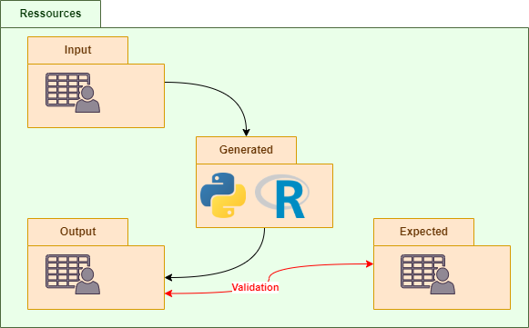

# Ingénierie Dirigée par les Modèles

## Travaux Pratiques : Compilateur depuis un langage spécifique vers Python et R pour traiter des fichiers CSV

### Récupérer le projet
Un dépôt Git est disponible à l’adresse suivante : https://github.com/StefanLocke/IDM-Projet.
La grammaire se trouve dans eclipse.idm.project.src.idm.projet.IdmDsl.xtext.
Un diagramme de classe représente les possibilités du langage. À la racine, le fichier se nomme class diagram.jpg. 

### Le choix du langage source et des langages cibles

Parmi les différentes propositions disponibles, l’équipe a choisi le traitement des données écrites en Comma-Separated Values (CSV) car ce format permet une retranscription en tableau Excel, largement utilisé aujourd’hui, ce qui aide à la visualisation des objectifs. On parlera alors de cellules, de lignes et de colonnes comme des éléments d’un tableau Excel. Non pas que ces notions soient étrangères au format brut d’un fichier CSV, mais plus parce que les images que l’on s’en fait sont plus claires.
Le langage source inventé dispose des fonctionnalités nécessaires et souhaitables pout interagir avec ces données. Que ce soient des instructions relatives aux calculs entre les cellules ou à la lecture/écriture complète de fichier, notre grammaire s’est voulue plutôt libre d’action, afin que nos tests soient considérés comme utiles pour un outil potentiellement développable.
Les cibles choisies sont Python et R. Ces langages relativement similaires permettent l’utilisation de librairies et restent assez faciles à écrire. De plus, certains membres de l’équipe s’y sentent à l’aise.

### Moyens de test

Le programme va utiliser votre commande python. Il est donc nécessaire d’avoir Python installé sur la machine. Si la commande est python ou python3, vous devez modifier en conséquence la valeur située dans eclipse.idm.project.tests.src.org.xtext.example.mydsl.tests.TestUtils.java. 
Il est également nécessaire d’avoir installé la librairie pandas (pour la lecture de CSV). pip install pandas. Il en va de même pour R, sauf qu’il n’y a pas a de changement de variable préalable à faire.

Afin de tester le bon déroulement de la compilation et l’exactitude du développement qui y est lié, des tests ont été réalisés. Pour les effectuer il y a besoin :
-	D’un programme du langage source compilé (en Python et en R) 
-	D’un fichier CSV (si le test souhaite modifier un fichier existant)
Et en sortie nous aurons :
-	Le code Python et R après 
-	Le résultat en CSV après l’application du langage compilé (en Python et en R) 
La disposition des ressources, dans eclipse.idm.project.tests.ressources, est la suivante :

#### Lancer les tests

Dans un premier temps, il faut qu’Eclipse prenne en compte la grammaire et syntaxe créée :
-	eclipse.idm.project.src.idm.project -> GeneratedIdmDsl.mwe2 -> Run As -> MWE2 Worflow
-	eclipse.idm.project.src.idm.project -> IdmDsl.xtext -> Run As -> Generate Xtext Artifacts

Ensuite, il faut lancer les tests pour Python et R de la façon suivante :
-	eclipse.idm.project.tests -> PythonCompilerTest.xtend -> Run As -> Junit Test
-	eclipse.idm.project.tests -> RCompilerTest.xtend -> Run As -> Junit Test
Les tests sont ainsi exécutés, et leur temps d’exécution est loggé dans la console.

 
### Résultats et performances

Suite à une batterie de tests réalisées avec JUnit concernant les performances de la compilation du langage source vers Python, on remarque une durée d’exécution d’environ 105 millisecondes.

Les tests vers le langage R quant à eux, montrent une performance pour des test similaires sur une durée de XXX millisecondes. On aurait donc tendance à penser que cette compilation est plus XXX, et donc que XXX est plus intéressant que XXX.

À ce stade, les données dont nous disposons ne sont pas suffisantes pour définir qu’elle est la meilleure variante à utiliser. Il faudrait plus de tests, beaucoup plus, et pouvoir les lancer sur des machines dont les capacités physiques diffèrent (pour éviter d’établir une affirmation uniquement grâce à une seule machine).
